# FrontAI - Generative UI Demo 🚀

A cutting-edge demonstration of Generative UI architecture using Nx monorepo, Module Federation, and AI-powered intent recognition with OpenAI/Azure OpenAI.

## 📋 Table of Contents

- [Overview](#overview)
- [Architecture](#architecture)
- [Prerequisites](#prerequisites)
- [Installation](#installation)
- [Configuration](#configuration)
- [Running the Demo](#running-the-demo)
- [How It Works](#how-it-works)
- [Available Commands](#available-commands)

---

## 🎯 Overview

This project demonstrates a **Generative UI** system where:
- Users interact with a chat interface
- An AI backend (OpenAI/Azure OpenAI) interprets user intents
- The system dynamically loads and renders appropriate UI components based on those intents
- Components are federated microservices loaded on-demand

### Main Components

| Component | Type | Port | Description |
|-----------|------|------|-------------|
| **router** | Backend Service (NestJS) | 3000 | Handles LLM communication, intent recognition, and chat history |
| **uihub** | Host Application (React) | 4200 | Main UI that orchestrates component loading based on user intents |
| **fems** | Microfrontend (React) | 4201 | Contains all UI modules/components exposed via Module Federation |
| **registry** | Library | - | JSONSchema definitions for UI modules and their required properties |
| **api-library** | Library | - | Shared API utilities and types |
| **types** | Library | - | TypeScript type definitions |

---

## 🏗️ Architecture

```mermaid
sequenceDiagram
    participant User as 👤 User
    participant UIHub as 💻 UIHub<br/>(Host :4200)
    participant FEMS as 📦 FEMS<br/>(Microfrontend :4201)
    participant Router as 🖥️ Router<br/>(Backend :3000)
    participant LLM as 🤖 OpenAI/Azure<br/>(LLM Service)

    User->>UIHub: 1. Types query in chat<br/>("Show me all users")
    
    UIHub->>Router: 2. POST /api/azureai/:sessionId/query<br/>{query: "Show me all users"}
    
    Note over Router: Retrieves chat history<br/>for session
    
    Router->>LLM: 3. Send prompt + schema + query
    
    Note over LLM: Analyzes intent<br/>using JSON schema
    
    LLM-->>Router: 4. Returns structured JSON<br/>{intent: "UsersTable",<br/>component: "UsersTable",<br/>confidence: 95}
    
    Note over Router: Saves to chat history
    
    Router-->>UIHub: 5. Intent response with<br/>component + parameters
    
    Note over UIHub: Looks up component<br/>in Module Federation map
    
    UIHub->>FEMS: 6. Lazy load component<br/>import('fems/UsersTable')
    
    FEMS-->>UIHub: 7. Component loaded
    
    UIHub->>User: 8. Renders UsersTable<br/>in Canvas Panel
    
    rect rgb(240, 248, 255)
        Note over User,LLM: 🔄 Exposed Components from FEMS<br/>UsersTable | UserDetails | EditUserForm<br/>BalancesView | TransactionDetails | ContextDisplay
    end
```



### Data Flow

1. **User Input** → User types a query in the chat interface (UIHub)
2. **API Request** → UIHub sends the query to Router backend (`POST /api/azureai/:sessionId/query`)
3. **LLM Processing** → Router:
   - Maintains conversation history per session
   - Sends query + system prompt + JSON schema to OpenAI
   - Receives structured JSON response with intent + component + parameters
4. **Intent Recognition** → LLM identifies the user's intent and maps it to:
   - Component name (e.g., "UsersTable")
   - Required parameters
   - Confidence score
5. **Dynamic Loading** → UIHub:
   - Receives the intent response
   - Looks up the component in Module Federation registry
   - Lazy loads the component from FEMS microfrontend
6. **Component Rendering** → The appropriate UI component is rendered with parameters

---

## ✅ Prerequisites

- **Node.js**: v18+ recommended
- **npm** or **yarn**
- **OpenAI API Key** or **Azure OpenAI credentials**
- **Nx CLI** (will be installed as dev dependency)

---

## 📦 Installation

1. **Clone the repository**
   ```bash
   git clone <repository-url>
   cd frontai
   ```

2. **Install dependencies**
   ```bash
   npm install
   ```

   This will install all dependencies including:
   - Nx workspace tools
   - React and React Router
   - NestJS framework
   - OpenAI SDK
   - Module Federation plugins
   - Material-UI components
   - And more...

---

## ⚙️ Configuration

### 1. Environment Variables

Create a `.env` file in the **`apps/router`** directory:

```bash
# For OpenAI
OPENAI_URL=https://api.openai.com/v1/chat/completions
OPENAI_API_KEY=your_openai_api_key_here
OPENAI_MODEL_NAME=gpt-4o

# For Azure OpenAI (alternative)
AZURE_OPENAI_API_KEY=your_azure_key
AZURE_OPENAI_ENDPOINT=https://your-resource.openai.azure.com
AZURE_OPENAI_DEPLOYMENT_ID=your-deployment-name
```

### 2. UIHub Environment (Optional)

Create `.env` in **`apps/uihub`** directory for any frontend-specific config:

```bash
REACT_APP_LAUNCHDARKLY_CLIENT_ID=your_ld_client_id
# Add other React app environment variables
```

### 3. System Prompt Configuration

The Router uses a sophisticated system prompt located at:
- **File**: `apps/router/src/app/openia/systemPrompts.ts`

This prompt instructs the LLM to:
- Identify user intents based on JSON schemas from the Registry
- Return structured JSON responses with confidence scores
- Handle ambiguous queries and request clarification
- Support RAG (Retrieval Augmented Generation) for knowledge-based queries

### 4. Registry Schemas

The Registry library (`libs/registry`) contains JSON schemas that define:
- Available UI components
- Required parameters for each component
- Intent names and mappings

**Location**: `libs/registry/src/lib/schemas/`

Example schema:
```typescript
// UsersTable.ts
export const UsersTableSchema = z.object({
  intentName: z.literal('UsersTable'),
  component: z.literal('UsersTable'),
});
```

---

## 🚀 Running the Demo

This is an **Nx monorepo**, so all commands use Nx CLI.

### Quick Start (Two Terminals)

#### Terminal 1: Start the Router (Backend)
```bash
npx nx serve router
```

This will:
- Build the router application
- Start the NestJS server on `http://localhost:3000`
- Enable API endpoints at `http://localhost:3000/api`
- Swagger documentation available at `http://localhost:3000/api`

#### Terminal 2: Start UIHub (Frontend Host)
```bash
npx nx serve uihub
```

This will:
- Start the Module Federation dev server
- Launch UIHub on `http://localhost:4200`
- Automatically start FEMS microfrontend on `http://localhost:4201`
- Enable Hot Module Replacement (HMR)

### Accessing the Application

Open your browser and navigate to:
```
http://localhost:4200
```

You should see:
- A chat interface
- An initial welcome screen
- Ability to type queries and interact with the AI

---

## 🔍 How It Works

### 1. Intent Recognition System

The Router backend uses a sophisticated prompt engineering approach:

**System Prompt Structure** (`apps/router/src/app/openia/systemPrompts.ts`):
- Defines JSON schema for all available intents
- Instructs LLM to respond with structured JSON
- Handles confidence scoring (0-99%)
- Supports RAG for knowledge-based queries
- Handles edge cases and ambiguous queries

**Example LLM Response**:
```json
{
  "intent": {
    "intentName": "UsersTable",
    "component": "UsersTable",
    "parameters": {}
  },
  "description": "Displaying the users table",
  "confidence": "95",
  "ragContext": ""
}
```

### 2. Module Federation Setup

**FEMS exposes components** (`apps/fems/module-federation.config.ts`):
```typescript
{
  name: 'fems',
  exposes: {
    './UsersTable': 'apps/fems/src/exposed_modules/UsersTable.tsx',
    './UserDetails': 'apps/fems/src/exposed_modules/UserDetails.tsx',
    // ... more components
  }
}
```

**UIHub consumes them** (`apps/uihub/module-federation.config.ts`):
```typescript
{
  name: 'uihub',
  remotes: ['fems', 'avatar']
}
```

**Dynamic Loading** (`apps/uihub/src/app/services/ui-client.tsx`):
```typescript
const UsersTable = React.lazy(() => import('fems/UsersTable'));

const IModulesMap = new Map();
IModulesMap.set('UsersTable', (props) => <UsersTable {...props} />);
```

### 3. Chat Flow

1. **User types**: "Show me the users table"
2. **UIHub sends**: `POST /api/azureai/:sessionId/query` with body `{ query: "Show me the users table" }`
3. **Router processes**:
   - Retrieves chat history for session
   - Adds system prompt with JSON schemas
   - Calls OpenAI API
   - Receives structured response
4. **Router responds**: JSON with intent, component, parameters
5. **UIHub renders**:
   - Parses response
   - Looks up component in `IModulesMap`
   - Lazy loads from FEMS
   - Renders in CanvasPanel

### 4. Session Management

- Each user session gets a unique `sessionId` (UUID)
- Chat history is maintained per session in memory
- Clear history endpoint: `POST /api/openai/:sessionId/clear`

---

## 📝 Available Commands

### Building Projects

```bash
# Build all projects
npx nx run-many -t build

# Build specific project
npx nx build router
npx nx build uihub
npx nx build fems

# Build libraries
npx nx build registry
npx nx build api-library
npx nx build types
```

### Running Projects

```bash
# Serve router (backend)
npx nx serve router

# Serve uihub (frontend host)
npx nx serve uihub

# Serve fems (microfrontend)
npx nx serve fems
```

### Testing

```bash
# Run all tests
npx nx run-many -t test

# Test specific project
npx nx test uihub
npx nx test fems
```

### Linting

```bash
# Lint all projects
npx nx run-many -t lint

# Lint specific project
npx nx lint router
npx nx lint uihub
```

### Type Checking

```bash
# Type check all projects
npx nx run-many -t typecheck

# Type check specific project
npx nx typecheck router
```

### Dependency Graph

```bash
# View project dependency graph
npx nx graph
```

### Production Builds

```bash
# Build router for production
npx nx build router --configuration=production

# Build uihub for production
npx nx build uihub --configuration=production

# Build fems for production
npx nx build fems --configuration=production
```

---

## 🎨 Example Interactions

### Example 1: Show Users Table
**User Input**: "Show me all users"
**System Response**: Renders `UsersTable` component with paginated user data

### Example 2: Edit User
**User Input**: "I want to edit user with ID 5"
**System Response**: Renders `EditUserForm` component with userId=5

### Example 3: View Balances
**User Input**: "Display my account balances"
**System Response**: Renders `BalancesView` component

### Example 4: Unknown Intent
**User Input**: "What's the weather today?"
**System Response**: "UnknownIntent" - asks for clarification or provides RAG context

---

## 🔧 Troubleshooting

### Router won't start
- Check `.env` file exists in `apps/router/`
- Verify OpenAI API key is valid
- Ensure port 3000 is not in use

### UIHub won't connect to Router
- Ensure Router is running on port 3000
- Check CORS is enabled in Router
- Verify API URL in `apps/uihub/src/app/services/api-client.ts`

### Components not loading
- Ensure FEMS is running on port 4201
- Check Module Federation config in both UIHub and FEMS
- Verify component is exposed in `apps/fems/module-federation.config.ts`

### Build errors
```bash
# Clear Nx cache
npx nx reset

# Reinstall dependencies
rm -rf node_modules package-lock.json
npm install
```

---

## 🚀 Next Steps

1. **Add more components**: Create new UI modules in `apps/fems/src/exposed_modules/`
2. **Extend schemas**: Add new intent schemas in `libs/registry/src/lib/schemas/`
3. **Enhance prompts**: Improve system prompts in `apps/router/src/app/openia/systemPrompts.ts`
4. **Add RAG**: Integrate vector database for knowledge retrieval
5. **Deploy**: Build for production and deploy to your hosting platform

---

## 📚 Technology Stack

- **Nx**: Monorepo management and build orchestration
- **React 18**: Frontend UI library
- **NestJS**: Backend framework
- **Module Federation**: Microfrontend architecture
- **Webpack 5**: Module bundler
- **OpenAI/Azure OpenAI**: LLM for intent recognition
- **TypeScript**: Type-safe development
- **Material-UI**: UI component library
- **Zod**: Schema validation
- **React Router**: Client-side routing

---

## 📄 License

MIT

---

## 🤝 Contributing

Contributions are welcome! Please follow standard Git workflow:
1. Fork the repository
2. Create a feature branch
3. Commit your changes
4. Push and create a Pull Request

---

**Happy Coding! 🎉**
